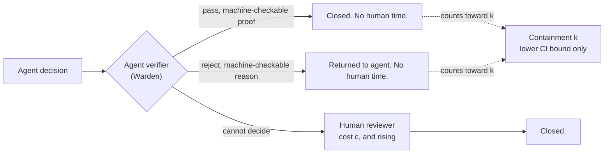
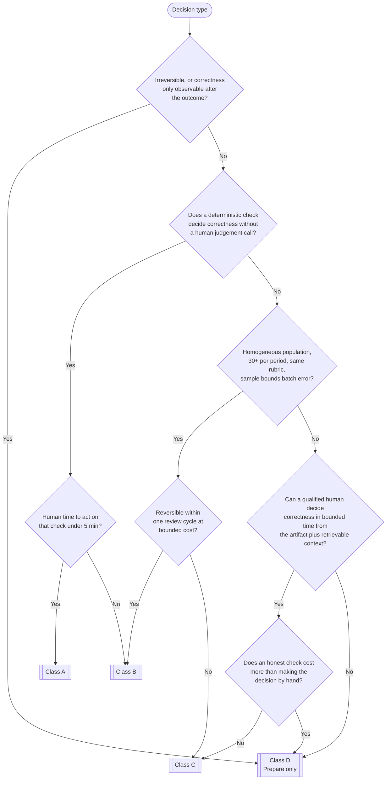

<p align="center">
  
</p>

<h1 align="center">VERB</h1>
<p align="center"><strong>The Verification Budget.</strong><br>
An operating model for autonomous AI in project delivery and end to end PMO.</p>

<p align="center">
  <a href="LICENSE"></a>
  
  
  
</p>

---

**Core claim**

> AI agents in project management are no longer constrained by model capability. They are constrained by **verification bandwidth**: how many agent decisions an organisation can genuinely review before review becomes rubber-stamping.

Everything in this repository follows from that one sentence. If you disagree with the claim, nothing downstream of it will be useful to you. If you accept it, the rest is arithmetic and operating discipline.

---

## Start here

**If you read nothing else, read this box.**

Your team has AI agents producing decisions. Somebody has to check those decisions before they count. That checking has a capacity, that capacity is smaller than people think, and nothing about better models makes it bigger.

When agents produce more decisions than your people can check, the extra ones do not stop. They get approved anyway, by a reviewer with eleven minutes and nineteen items in a queue. The approval is recorded. The checking is not. Nobody chose to do this and there is no error message for it.

This repository gives you one number and what follows from it.

| I want to | Do this | Takes |
|---|---|---|
| See my own number | Open the **[calculator](https://hotragn.github.io/verb)**. Four inputs per row. | 2 minutes |
| Understand why it matters | Read [section 1](#1-the-constraint) and [section 2](#2-the-verification-budget). | 10 minutes |
| Run it on my own data | `pip install verb-vb`, then `vb budget` | 15 minutes |
| Implement the whole model | Read this file end to end. No code needed. | an afternoon |
| See it working on example data | `vb budget --input examples/pmo40` | 1 minute |

### Install

```bash
pip install verb-vb
```

Then, with no data of your own:

```bash
vb budget --reviewers 6 --hours 8 --utilisation 0.55 --cost 1.25 --demand 70
```

No install at all: open [`calculator/index.html`](calculator/index.html) from disk, or use the hosted copy at **[hotragn.github.io/verb](https://hotragn.github.io/verb)**. It runs entirely in your browser, makes no network requests, and sends nothing anywhere.

### The four things to measure

You can get three of these from a spreadsheet this afternoon. The fourth is the one that matters and the one almost nobody has.

| | What it is | Where to get it |
|---|---|---|
| **R** | People genuinely qualified to judge this kind of decision. Not everyone with the approve button. | Ask who you would defend if the decision went wrong. |
| **H** | Hours a week each of them has nominally set aside for reviewing. | Their calendar. |
| **u** | The share of those hours that survives meetings and holidays. Between 0 and 1. | A fortnight of calendars. 0.5 is a fair first guess. |
| **c** | Hours it takes one qualified person to genuinely check one decision. | **Measure it.** Time 30 reviews, then ask each reviewer afterwards whether they really checked, and discard the ones who say no. |

That last step in `c` is the one everybody skips, and it is the step that separates a verification cost from an approval duration. Under overdraft those are different quantities.

### If you are not in a PMO

The framework is written in the vocabulary of project delivery because that is where it was built, but nothing in the arithmetic is specific to it. If your organisation has agents producing decisions and humans approving them, the model applies. Swap the examples for your own. The one thing that does not transfer is the calibration: the cost ranges in [section 3](#3-the-four-decision-classes) are project-delivery numbers and you should discard them rather than reuse them.

---

This README is the specification. The code in `/vb`, the schemas in `/schema` and the calculator in `/calculator` are a reference implementation of what is written here. A PMO director should be able to implement the whole model from this file with no code at all. The code exists so that nobody has to argue about what the definitions mean.

---

## Contents

1. [The constraint](#1-the-constraint)
2. [The verification budget](#2-the-verification-budget)
3. [The four decision classes](#3-the-four-decision-classes)
4. [The deployment inversion](#4-the-deployment-inversion)
5. [The agent role contract](#5-the-agent-role-contract)
6. [The evidence plane](#6-the-evidence-plane)
7. [The six operating metrics](#7-the-six-operating-metrics)
8. [The four eval gates](#8-the-four-eval-gates)
9. [Maturity stages S0 to S4](#9-maturity-stages-s0-to-s4)
10. [Known limitations](#10-known-limitations)
11. [Worked example: PMO-40](#11-worked-example-pmo-40)
12. [Repository map](#12-repository-map)
13. [Quickstart](#13-quickstart)
14. [Names used in this repository](#14-names-used-in-this-repository)
15. [Cite this work](#15-cite-this-work)

---

## 1. The constraint

For thirty years the scarce thing in a PMO was production. Somebody had to write the status report, reconcile the schedule against the actuals, chase the risk owners, draft the change request, and rebuild the forecast after the change request landed. Capacity planning meant counting the people who could produce those artifacts.

That constraint is gone. A competent agent produces a defensible status pack for forty projects in the time it takes to open the file. Production is no longer scarce, and planning capacity around production is now planning around the wrong number.

The number that did not move is **review**.

An organisation can review a fixed and surprisingly small quantity of agent decisions per week. That quantity is set by how many people are qualified to judge the decision, how many hours they actually have, and how long a single judgement takes. None of those three things improved when the models improved. Two of them got worse, because agents now generate decisions faster than the review queue drains, and because the artifacts arrive with a fluency that makes them harder, not easier, to check.

When production exceeds review capacity, the excess does not stop. It gets approved anyway.

This is the failure mode that matters, and it is not a behavioural problem. Nobody decides to rubber-stamp. What happens is that a reviewer with eleven minutes and nineteen decisions in the queue produces nineteen approvals, and every one of those approvals is recorded in the system as a review. The governance record is intact. The governance is not. There is no error message for this. It looks exactly like a functioning PMO right up until the point where something goes wrong and nobody can reconstruct who checked what.

Three definitions, used consistently for the rest of this document.

| Term | Definition |
|---|---|
| **Verification bandwidth** | The number of agent decisions an organisation can genuinely review per period, for a given class of decision. |
| **Genuine review** | A review in which the reviewer could, if asked, state what the decision was, what it rested on, and what would have made them reject it. |
| **Silent drift** | The gap between recorded approvals and genuine reviews. Approval without verification. It is silent because the system records it as success. |

**Rubber-stamping is not a discipline failure. It is what an overdrawn verification budget looks like from the inside.** You cannot train it away and you cannot policy it away, because the reviewer is behaving rationally under the constraint they have been handed. You can only budget it.

The rest of this specification is a way to make that budget explicit, measure it, and deploy agents inside it.

---

## 2. The verification budget

### 2.1 The formula

For each decision class, per period:

```
              R × H × u
        VB = -----------
                  c
```

| Symbol | Meaning | Unit |
|---|---|---|
| **VB** | Verification budget. Decisions of this class that can genuinely be reviewed this period. | decisions / period |
| **R** | Reviewers **qualified for this class**. Not headcount. Not FTE. The people whose approval on this class of decision would survive scrutiny. | people |
| **H** | Review hours per qualified reviewer per period. | hours / person / period |
| **u** | Utilisation. The fraction of H actually available for verification after meetings, escalations, holidays and everything else. | 0 to 1 |
| **c** | Verification cost. Hours of qualified human time to genuinely review one decision of this class. | hours / decision |

The units work out to decisions per period, which is the point. VB is a rate, and it is compared against a rate.

**D** is demand: decisions of this class produced per period, whether by agents or by people.

```
        O = D / VB           overdraft ratio
```

| O | Meaning |
|---|---|
| O < 0.95 | In budget. Review is real. |
| 0.95 ≤ O ≤ 1.0 | At the limit. No absorption capacity for a bad week. |
| O > 1.0 | **Overdraft.** The excess is being approved without being verified. |

The quantity `(1 - 1/O)` when O > 1 is the fraction of decisions in that class that are, structurally, unverified. Not "at risk of being unverified". Unverified. The arithmetic does not leave anywhere else for them to go.

### 2.2 A worked instance

A PMO with six people qualified to review schedule re-baselining, each with eight nominal review hours a week, of which 55 percent survives contact with the calendar. Genuine review of one re-baseline takes 1.25 hours.

```
        VB = (6 × 8 × 0.55) / 1.25 = 26.4 / 1.25 = 21.1 decisions per week
```

Twenty-one. If the agents produce seventy re-baselines a week, O is 3.3, and roughly seven out of every ten carry an approval that nobody could defend. This is the figure reproduced in [`/examples/pmo40`](examples/pmo40).

### 2.3 The five levers, and which ones are real

There are exactly five ways to move O. Not four, not six.

| Lever | Direction | Realistic range | Notes |
|---|---|---|---|
| **R** raise qualified reviewers | VB up | slow, months | Qualification is the bottleneck, not hiring. Adding an unqualified reviewer adds recorded approvals, not verification. |
| **H** raise review hours | VB up | small | Bounded by the working week. Usually already at the ceiling. |
| **u** raise utilisation | VB up | 0.4 to 0.7 realistic | Protecting review time is the cheapest real gain most PMOs have available. Above 0.7 is fiction. |
| **c** cut verification cost | VB up | **large** | The only lever with orders of magnitude in it. Sections 2.4, 4 and 6 are all about this. |
| **D** cut demand | O down | large | Batch, set standing policy, stop asking for the decision. Underrated. |

Only `c` and `D` have real range. That is the entire strategic content of this framework, and section 4 is its consequence.

### 2.4 Agentic verification: reducing c with agents

An agent can consume verification budget. An agent can also **supply** it. This is the part of the model that matters for a fully autonomous operating model, and it is also the part that is easiest to get wrong.

When an agent verifier sits in front of a human reviewer, the effective verification cost becomes:

```
        c_eff = c_a + (1 - k) × c
```

| Symbol | Meaning |
|---|---|
| **c_a** | Human hours spent per decision on the agent verifier's own output. Reading the verdict, not redoing the work. Small but never zero. |
| **k** | **Containment.** The fraction of decisions the verifier closes without human involvement, either by passing them or by rejecting them with a machine-checkable reason. |
| **c** | The original human verification cost for the class. |

Then `VB_eff = (R × H × u) / c_eff`. As k rises, VB rises without hiring anybody.

This is where the model has teeth, and it is also where it has a trap. Three rules make agentic verification real rather than decorative.

> **The recursion rule.** An agent may verify another agent's decision only if the verifier's own output is Class A, meaning machine-checkable. If checking the verifier costs a human as much as checking the original decision, you have moved the cost, not removed it.

> **The calibration rule.** Containment counts only if the verifier's false-negative rate has been measured against a labelled set that includes known-bad decisions. An unmeasured verifier is a c reduction on paper and a risk transfer in fact. Uncalibrated verifiers are assigned **k = 0**. See [Gate 3](#gate-3-verifier-calibration).

> **The conservatism rule.** Use the **lower bound of the 95 percent confidence interval** on k in the budget, never the point estimate. You are sizing a safety margin, not writing a press release.

There is a fourth thing worth knowing, and it is in [Known limitations](#10-known-limitations) as well because it bites in production: a verifier closes the easy decisions first. The residual queue that reaches the human is therefore harder than the original average, so **c rises as k rises**. Re-measure c after every material change to k. A budget that assumes c is constant while k climbs will over-report capacity exactly when it matters.



### 2.5 What the budget is not

- It is not a risk model. It says nothing about whether a decision *should* be checked. It says what checking *costs*.
- It is not a schedule. VB is a rate. Arrival of decisions is bursty. You can be under budget on average and still drop reviews in week three. See [Known limitations](#10-known-limitations), item 3.
- It is not constant across organisations. c is a property of a decision type *in your organisation with your evidence*. The same decision is Class C in one PMO and Class A in another that has the telemetry.

---

## 3. The four decision classes

Decisions are classified by **the cost of checking them**. Not by risk. Not by value. Not by how hard the task is for the model.

This is the move that makes the rest work, and it is the one people resist, because every governance framework they have used classifies by risk. Risk tells you *whether* you must check. Class tells you *what checking costs*. You need both, and only one of them is missing from most operating models.

| Class | Name | Test | Typical c | Agent authority |
|---|---|---|---|---|
| **A** | Machine-checkable | A deterministic check decides correctness. Human time is exception handling only. | 0.01 to 0.05 h | Full, within contract |
| **B** | Sample-checkable | No single test, but the population is homogeneous enough that a sample bounds the error rate for the batch. | 0.05 to 0.25 h amortised | Full, with sampling |
| **C** | Expert-checkable | A qualified human must reconstruct the reasoning against context that is not in the artifact. | 0.5 to 3 h | Propose only |
| **D** | Not checkable in advance | Correctness is observable only after the outcome, or the decision is irreversible, or the check costs more than the decision. | undefined | **None** |

### Class A, machine-checkable

A deterministic check exists and running it costs almost no qualified human time. The human sees only the exceptions.

PMO examples: schedule arithmetic and float calculation, dependency cycle detection, RAID register field completeness, budget rollup reconciliation against the ledger, timesheet compliance, invoice to purchase-order matching, baseline variance thresholds, resource over-allocation detection.

The tell: you can write the check as a test, and the test's verdict is the answer, not an input to a judgement.

### Class B, sample-checkable

No single deterministic test decides an individual case, but the decisions come in a homogeneous population governed by the same rubric, so checking a sample bounds the error rate across the batch. c is the sample cost amortised over the batch.

PMO examples: status narrative drafting across a portfolio, action extraction from meeting minutes, risk re-scoring against a fixed rubric, categorising change requests, first-pass supplier invoice queries, weekly RAG rating proposals.

The tell: you would be comfortable checking twenty of them and drawing a conclusion about the other two hundred. If that sentence makes you uncomfortable, it is not Class B.

Sampling is only valid when the population really is homogeneous. Class B collapses to Class C the moment the batch contains a few decisions that matter far more than the rest, because a sample will miss them. Stratify or reclassify.

### Class C, expert-checkable

A qualified human can determine correctness, but doing so means reconstructing the reasoning against context that is not in the artifact: the political situation with the vendor, what the sponsor said in March, why that dependency exists at all.

PMO examples: critical-path re-baselining, change-request impact assessment, resource reallocation across programmes, vendor scope dispute positions, forecast revision beyond tolerance, dependency renegotiation between workstreams.

The tell: two qualified people could look at the same artifact and reasonably disagree, and resolving that disagreement requires knowledge neither of them wrote down.

Class C is where verification budget is actually spent, and where overdraft accumulates. It is also where most of the value is, which is why this framework exists.

### Class D, not checkable in advance

Correctness cannot be established before the outcome. Either the decision is irreversible, or its consequences unfold over a horizon longer than the review cycle, or an honest check costs more than making the decision by hand.

PMO examples: cancelling a workstream, terminating a contract, declaring a programme red to the board, escalating to a regulator, redundancy selection, go-live authorisation on a safety-relevant system, accepting a risk above appetite.

> **Class D decisions are never delegated to agents. Agents prepare Class D decisions. Humans make them.**

This is not caution, it is arithmetic. A Class D decision has no finite c, so it has no verification budget, so there is no quantity of it you can afford. Delegating it is not a risk appetite choice, it is spending money you do not have.

The gain is real anyway, and it comes from a structural move:

> **Class D work is delivered as Class C artifacts.** The decision stays with the human. The *preparation* of the decision (options, impacts, precedent, reversal cost, the named recommendation) is an artifact whose quality a human can check in bounded time. You get most of the throughput without delegating the decision.

In the PMO-40 example, six of the seventy weekly Class C reviews are exactly this: change-authority preparation packs for decisions that only a human will make.

### 3.1 Classification decision tree



Three tie-breakers, applied in this order:

1. **Reversibility.** If the decision were wrong and went undetected for one full review cycle, could it be undone at bounded cost? If no, it is at least Class C and probably Class D, whatever the tree said.
2. **Disagreement.** If two qualified classifiers disagree, take the more expensive class and record the disagreement. Disagreement rate is a metric about your rubric, not about your people. These are being collected, see [CONTRIBUTING.md](CONTRIBUTING.md).
3. **Default.** Anything unclassified is Class D until classified. Not Class C. The default has to be the expensive one or the default becomes the loophole.

Full definitions, worked classifications and the reclassification procedure: [`spec/decision-classes.md`](spec/decision-classes.md).

---

## 4. The deployment inversion

The standard way to choose where to deploy an agent is to ask where the model performs well. That question is now nearly always answered yes, which means it has stopped carrying information.

**Deploy where checking is cheap, not where the task is easy.**

```
                        verification cost c
                     LOW                    HIGH
                 +----------------------+----------------------+
            HIGH |                      |                      |
                 |       DEPLOY         |      THE TRAP        |
      model      |                      |                      |
      capability |  cheap to check,     |  works in the demo,  |
                 |  agent does it well. |  nobody can check it |
                 |  This is the whole   |  at volume. This is  |
                 |  game.               |  where the overdraft |
                 |                      |  comes from.         |
                 +----------------------+----------------------+
            LOW  |                      |                      |
                 |        WAIT          |       DO NOT         |
                 |                      |                      |
                 |  harmless, low       |  worst of both.      |
                 |  value. Revisit at   |  No upside path.     |
                 |  the next model.     |                      |
                 +----------------------+----------------------+
```

The top-right quadrant is where nearly every impressive AI-in-PMO demo lives. Strategic dependency renegotiation. Portfolio prioritisation. Vendor dispute strategy. The model is genuinely good at these. They are also Class C or D, meaning c is between 0.5 and 3 hours, meaning your verification budget is a couple of dozen a week, meaning the deployment is capped at a couple of dozen a week no matter how good the model gets.

You do not fix the top-right quadrant by deploying harder. You fix it by moving decisions left.

### 4.1 Moving left: reclassification before deployment

Reclassification is making a decision cheaper to check. It is engineering work, not paperwork. Renaming a Class C decision to Class B does nothing except hide the overdraft.

| Move | How | Effect on c |
|---|---|---|
| C to B | Homogenise the decision. Fix the rubric, standardise the inputs, remove case-by-case discretion so that a sample genuinely bounds the batch. | 0.5 to 3 h becomes 0.05 to 0.25 h |
| C to B | Enforce the [evidence plane](#6-the-evidence-plane). Most of c is the reviewer re-gathering inputs the agent already had. | typically 30 to 60 percent cut |
| B to A | Build the deterministic check. If you can write the test, write it. This is usually a week of work and it permanently changes the budget. | 0.05 to 0.25 h becomes 0.01 to 0.05 h |
| any to cheaper | Instrument the context. A decision is Class C mostly because the context is in someone's head. Put it in a system and the same decision becomes checkable. | varies, large |
| D to C | Split the decision from its preparation. Agent prepares, human decides. | makes the work budgetable at all |

**The order of operations is: reclassify, then deploy.** Deploying first and reclassifying later means you run an overdraft during the gap, and the overdraft is invisible, so the gap will not close.

### 4.2 The decision rule

Rank candidate deployments by value per unit of verification cost, not by value alone:

```
        priority = (annual value of the decision type)
                   ---------------------------------------
                   (decisions per year) × (c for that type)
```

The denominator is the verification budget the deployment will consume. A deployment that consumes more budget than it is worth should not ship, regardless of how well the model performs on it. This is the only ranking in this document and it is deliberately crude, because a crude ranking that includes c beats a sophisticated one that does not.

---

## 5. The agent role contract

Every agent operating in the PMO has a contract. Four fields. Not three, not nine.

Nine-field contracts do not get read during an incident. Four is the number a reviewer can hold in their head at 6pm on a Friday when something has gone wrong and somebody has to decide whether to pull the agent.

| # | Field | Question it answers | Failure if missing |
|---|---|---|---|
| 1 | **Scope** | Which decision types may this agent decide, by class, and which are explicitly excluded? | Scope creep is invisible. The agent ends up making Class C decisions that nobody classified. |
| 2 | **Evidence** | What must the agent emit for every decision? | Decisions arrive unverifiable. c goes up, verification budget goes down, and nobody notices why. |
| 3 | **Escalation** | Under what named conditions does it stop, and to which named human role? | Escalation becomes discretionary, which means it stops happening under load, which is precisely when it is needed. |
| 4 | **Revocation** | How is this agent's authority withdrawn, by whom, in what time, and what happens to in-flight work? | You cannot turn it off. Everything else in the contract is decoration if this one is absent. |

### 5.1 The rules on each field

**Scope.** Decision types are named individually and tagged with their class. An unnamed decision type is **out of scope by default**, and encountering one is an escalation condition, not a judgement call. Scope must state exclusions explicitly even where they seem obvious, because "obvious" is not a property that survives a model upgrade. No agent contract may include a Class D decision type in scope.

**Evidence.** Names the six evidence plane fields the agent must emit, plus any class-specific additions. The binding rule:

> **If the agent cannot produce the required evidence for a decision, it must not make the decision.** It escalates instead. Failing to produce evidence is never an acceptable degraded mode.

Agent verifiers carry an extra evidence obligation: their measured false-negative rate, the date and size of the labelled set it was measured on, and the containment they claim. Without those, containment is zero.

**Escalation.** Conditions are named and testable. "When uncertain" is not a condition. "When the confidence in the decision artifact is below 0.8" is a condition. Every contract carries three mandatory escalations regardless of what else it names:

- an unclassifiable decision type,
- required evidence that cannot be produced,
- any decision that would be Class D.

The escalation target is a **role**, and the role must resolve to a named person at decision time. An escalation to "the PMO" is an escalation to nobody.

**Revocation.** Must be executable by one named person, without a meeting, within a stated time. It must state what happens to work already in flight: does it stop, does it complete, does it roll back. A revocation clause that requires a change advisory board is not a revocation clause, it is a hope.

### 5.2 Worked example

Two more, including a verifier agent, are in [`spec/agent-role-contract.md`](spec/agent-role-contract.md). The machine-readable form is [`schema/agent-contract.schema.json`](schema/agent-contract.schema.json).

```yaml
agent_id: schedule-integrity-01
name: Schedule Integrity Agent
version: "1.4.0"

scope:
  in_scope:
    - decision_type: critical_path_recalculation
      decision_class: A
    - decision_type: dependency_cycle_flagging
      decision_class: A
    - decision_type: float_erosion_alert
      decision_class: A
    - decision_type: milestone_slip_categorisation
      decision_class: B
      sampling_rate: 0.15
  excluded:
    - decision_type: schedule_rebaselining
      reason: "Class C. Agent proposes via change-impact-01, does not decide."
    - decision_type: milestone_removal
      reason: "Class D. Requires change authority."
  unlisted_types: escalate

evidence:
  required_fields: [decision, basis, alternatives, confidence_and_failure_mode, reversal, owner]
  artifact_schema: schema/decision-artifact.schema.json
  on_evidence_failure: escalate
  retention_days: 730

escalation:
  conditions:
    - id: low_confidence
      test: "confidence < 0.80"
      to_role: portfolio_scheduler
    - id: unclassified_type
      test: "decision_type not in scope.in_scope"
      to_role: pmo_lead
    - id: evidence_unavailable
      test: "any required evidence field cannot be produced"
      to_role: portfolio_scheduler
    - id: class_d_detected
      test: "classification result == D"
      to_role: change_authority_chair
    - id: cross_programme_impact
      test: "affected_programmes > 1"
      to_role: pmo_lead
  target_resolution: named_person_at_decision_time
  max_response_hours: 8

revocation:
  who: [pmo_lead, head_of_delivery]
  method: "Set agent status to REVOKED in the agent registry. Single action, no approval chain."
  max_time_to_effect_minutes: 15
  in_flight_work: halt_and_mark_unverified
  rollback: "All decisions from the last 24h flagged for human re-review. Class A decisions auto-revalidated by deterministic check."
  notify: [portfolio_scheduler, change_authority_chair]
```

---

## 6. The evidence plane

The evidence plane is the set of fields every agent decision must carry. Six of them.

**The evidence plane exists to reduce c.** It is not an audit trail, and treating it as one produces the wrong fields. An audit trail is optimised for reconstructing the past. The evidence plane is optimised for making the next review fast. Those two goals produce different artifacts, and only one of them changes the budget.

| # | Field | What it is | How it cuts c |
|---|---|---|---|
| 1 | `decision` | What was decided, as a single action sentence, with the object named by a stable ID. | The reviewer knows what they are approving before they start. Sounds trivial. Is not. |
| 2 | `basis` | The actual inputs used. Each with a source ID and a retrieval timestamp. A list, not a summary. | Removes the reviewer's need to re-gather inputs. In practice this is the largest single component of c. |
| 3 | `alternatives` | What was considered and rejected, with the reason for each rejection. At least one, or an explicit statement that the decision was forced. | Converts "is this right?", which is unbounded, into "is this rejection reason wrong?", which is bounded. |
| 4 | `confidence_and_failure_mode` | A calibrated confidence plus the specific way this decision would be wrong. | Tells the reviewer what to look for. A named failure mode is a search target. "May be inaccurate" is not. |
| 5 | `reversal` | How to undo it, the cost of undoing it, and the window in which undoing is still cheap. | Lets the reviewer decide how hard to look. Cheap and reversible earns a lighter check, honestly rather than accidentally. |
| 6 | `owner` | The named human accountable. Resolved to a person at decision time, not a role. | Prevents the diffusion of accountability that makes review optional in the first place. |

> **A decision artifact missing any of the six fields is not a decision. It is an output. Outputs must not be actioned.**

That line is the enforcement point. It is a schema check, it belongs in the pipeline, and it is [Gate 2](#gate-2-evidence).

### 6.1 Example artifact

```json
{
  "artifact_id": "da-2026-0819-0447",
  "decision_type": "milestone_slip_categorisation",
  "decision_class": "B",
  "agent_id": "schedule-integrity-01",
  "timestamp": "2026-08-19T09:14:22Z",

  "decision": "Categorise slip on milestone MS-PRG7-014 as supplier-caused, 11 working days, absorbed by float.",

  "basis": [
    {"source_id": "P6:PRG7:baseline:v12", "retrieved_at": "2026-08-19T09:13:58Z", "detail": "Baseline finish 2026-09-30, float 14d"},
    {"source_id": "JIRA:PRG7-2291", "retrieved_at": "2026-08-19T09:14:01Z", "detail": "Supplier confirmed delay in writing 2026-08-15"},
    {"source_id": "SUP:ACME:SLA:2025-11", "retrieved_at": "2026-08-19T09:14:03Z", "detail": "SLA clause 7.2, notification met"}
  ],

  "alternatives": [
    {"option": "Categorise as scope-change-caused", "rejected_because": "No approved change request in the window. CR-PRG7-0088 closed 2026-07-02."},
    {"option": "Escalate as float-consuming risk", "rejected_because": "Remaining float 3d after absorption, above the 2d escalation threshold."}
  ],

  "confidence_and_failure_mode": {
    "confidence": 0.86,
    "failure_mode": "If the supplier delay is a symptom of an undisclosed resource loss on their side, the 11-day figure understates the slip and float absorption is wrong. Detectable at the next supplier checkpoint on 2026-08-26.",
    "calibration_basis": "Reliability measured on 240 labelled categorisations, 2026-Q2. Brier score 0.09."
  },

  "reversal": {
    "how": "Re-run categorisation with corrected cause code, re-issue slip notice to programme board.",
    "cost_hours": 0.5,
    "cheap_until": "2026-09-02T00:00:00Z",
    "cheap_until_reason": "Programme board pack lock for the September cycle."
  },

  "owner": {
    "person_id": "u-2291",
    "name": "R. Okonjo",
    "role": "portfolio_scheduler",
    "resolved_at": "2026-08-19T09:14:22Z"
  }
}
```

Field-by-field specification, rationale and anti-patterns: [`spec/evidence-plane.md`](spec/evidence-plane.md). Schema: [`schema/decision-artifact.schema.json`](schema/decision-artifact.schema.json).

### 6.2 The cost of the evidence plane

Producing `basis` and `alternatives` is not free. It roughly doubles token cost and adds latency, because the agent has to do work it would otherwise skip. That is the price of a cheap check, and it is a good trade at almost any realistic ratio, because agent tokens are cheap and qualified reviewer hours are the binding constraint. But it is a real cost and pretending otherwise makes the model less credible, not more.

---

## 7. The six operating metrics

Six. Reported per decision class, per period. If you report them portfolio-wide you will average a healthy Class A over a drowning Class C and see nothing.

| # | Metric | Symbol | Target | What it tells you |
|---|---|---|---|---|
| 1 | Verification Budget | VB | measured, not targeted | Capacity. Everything else is relative to this. |
| 2 | Overdraft Ratio | O | ≤ 1.0 | Whether you are spending capacity you have. |
| 3 | Silent Drift Rate | SDR | ≤ baseline + 0.05 | Whether approvals are real. **The headline metric.** |
| 4 | Containment | k | measured, with FNR | How much verification the agents are genuinely supplying. |
| 5 | Escalation Precision | EP | ≥ 0.7 | Whether escalations are worth the budget they consume. |
| 6 | Reversal Latency | RL | ≤ one review cycle | Whether the safety net is real or theoretical. |

### 7.1 The measured input: ĉ

VB cannot be computed without c, and **c must be measured, not estimated**. An estimated c produces a budget that is a restatement of your assumptions. Most organisations at [S0](#9-maturity-stages-s0-to-s4) do not have a c and do not know it.

The measurement protocol, in full in [`spec/metrics.md`](spec/metrics.md):

1. Sample at least 30 decisions per class.
2. Measure wall-clock time from artifact-open to approval-submit, per reviewer.
3. Trim idle gaps over 10 minutes.
4. Confirm with the reviewer afterwards that they genuinely checked. Discard the ones where they say no. This is the step everybody skips and it is the step that makes the number mean something.
5. ĉ is the **median** of what survives. Not the mean. The distribution is right-skewed and the mean flatters you.
6. Re-measure quarterly, and after any material change to the evidence plane, the artifact length, or k.

Reviewers work faster when observed, so ĉ measured this way is biased low, which makes VB biased high. Say so out loud when you present it. It is stated again in [Known limitations](#10-known-limitations).

### 7.2 Silent drift, exactly

Silent drift is approval without verification. It is measured by review duration against a per-class floor.

**Definition.** For decision class X with floor `f_X` hours, over approval events `i = 1..N` in the period:

```
        drift_i = 1  if d_i < f_X
                  0  otherwise

                      N
        SDR_X = (1/N) Σ  drift_i
                     i=1
```

where `d_i` is the idle-trimmed duration from artifact-open to approval-submit for the reviewer of record.

**Setting the floor.** The floor is not a target and not a policy. It is the line below which a genuine review could not have physically happened.

```
        f_X = max( P10(baseline durations for class X),
                   words_in_median_artifact / 240 / 60 )
```

- `P10` of a **calibrated baseline**: at least 30 reviews per class, collected during a period in which reviewers were observed and confirmed they genuinely checked.
- The second term is a physical reading floor. 240 words per minute is a defensible skim-to-comprehend rate for technical material. Divided by 60 to give hours.
- Take the larger of the two.
- Re-derive quarterly, or whenever the median artifact length moves by more than 25 percent.

**Why P10 and not the median.** You are not trying to catch fast reviewers. You are trying to catch reviews that could not have occurred. P10 of a calibrated baseline is a conservative "nobody who is genuinely checking goes faster than this" line.

**The 10 percent baseline.** By construction, a P10 floor produces SDR ≈ 0.10 when nothing is wrong. So the signal is not SDR itself. The signal is:

```
        excess drift = max(0, SDR_X - 0.10)
```

Report excess drift. An SDR of 0.11 is a healthy system. An SDR of 0.34 is a PMO where a third of approvals are decorative.

**Trend.** Fit an ordinary least squares slope across per-period SDR values.

| Slope (drift fraction per period) | Label |
|---|---|
| > +0.02 | rising |
| between -0.02 and +0.02 | flat |
| < -0.02 | falling |

Rising drift with O > 1 is the diagnostic signature of this whole framework: the overdraft first becomes backlog, then becomes late nights, then becomes drift. Backlog absorbs the overdraft for a few weeks, which is why drift usually lags overdraft by a month or two and why people conclude the overdraft was harmless. It was not. It was queued.

**Two secondary signals**, reported alongside but never used as the metric:

- **Variance collapse.** The coefficient of variation of review durations dropping below 0.15 means reviews have become uniform, which real reviews are not.
- **Batch bursts.** Three or more approvals by one reviewer within 60 seconds. Legitimate occasionally. Never as a pattern.

**The rule that keeps the metric alive:** SDR is never used for individual performance management. The moment it is, durations become a thing people manage rather than a thing you measure, and the metric is dead within one cycle. Report it by class, not by person. This is not a nicety, it is a measurement-validity requirement.

### 7.3 The other four, briefly

- **Containment k** = decisions closed by the agent verifier without human involvement, divided by total decisions offered to it. Reported with the verifier's measured false-negative rate and the 95 percent CI. The budget uses the CI lower bound. k without FNR is not a metric, it is a claim.
- **Escalation Precision** = escalations a human agreed needed escalating, divided by total escalations. Below 0.7 means the agent is spending your scarcest resource on nothing. Escalation *recall* is what you actually want and you cannot measure it directly, because you do not see the escalations that should have happened and did not. Partial proxies are in [`spec/metrics.md`](spec/metrics.md). Be honest that this is a gap.
- **Reversal Latency** = median hours from a wrong decision entering the system to it being reversed. This is the metric that tells you whether `reversal` in the evidence plane is real. If RL exceeds the `cheap_until` window on most artifacts, your reversal field is fiction and any class assignment that relied on reversibility needs revisiting.
- **VB and O** as defined in section 2.

Formal definitions, edge cases and worked calculations: [`spec/metrics.md`](spec/metrics.md).

---

## 8. The four eval gates

Four gates. Each has a stated pass criterion and a stated cadence. A gate without a numeric pass criterion is a meeting.

| Gate | Question | Cadence |
|---|---|---|
| 1. Classification | Do we agree what class this is? | Before deployment, and on material model or prompt change |
| 2. Evidence | Is every decision verifiable at the cost we assumed? | Continuous |
| 3. Verifier calibration | Is the containment we are banking real? | Quarterly, and on any verifier change |
| 4. Replay | Would this agent have been right on history we already know? | Before deployment, and on material change |

### Gate 1: Classification

**Procedure.** Two qualified classifiers independently classify the same 50 sampled decisions of the target type, without conferring.

**Pass criteria, all required:**
- Cohen's kappa ≥ 0.70 between the two classifiers.
- Zero decisions classified D by *either* classifier remain in the agent's scope.
- Every disagreement resolved by taking the more expensive class, and logged.

**Why it exists.** If you cannot agree on the class, you do not know what c is, so you do not know what VB is, so the budget is decoration. This gate fails more often than teams expect, and that failure is the most useful thing it produces.

### Gate 2: Evidence

**Procedure.** Machine-validate a sample of decision artifacts against `schema/decision-artifact.schema.json`. Then a human reviews 20 of them for substance.

**Pass criteria, all required:**
- 100 percent schema validity. Not 99. A missing field means the artifact is an output, not a decision.
- At least 95 percent of the human sample confirmed substantive, meaning: `basis` entries resolve to real, retrievable sources; `alternatives` are options a competent person would actually have considered, not straw men; `failure_mode` names a specific, detectable failure.
- Measured ĉ on the sample within 25 percent of the ĉ used in the budget. If review is costing more than you budgeted, VB is wrong right now.

**Why it exists.** The evidence plane degrades quietly. `alternatives` fills up with "do nothing" and `basis` fills up with restatements of the decision. Both pass a schema check. Only the human sample catches them.

### Gate 3: Verifier calibration

This is the gate that makes agentic verification safe to bank, and the reason [section 2.4](#24-agentic-verification-reducing-c-with-agents) is not wishful thinking.

**Procedure.** Run the verifier against a labelled set of at least 200 decisions containing at least 30 known-bad ones. Known-bad decisions must come from real history where possible, and must include the failure modes you actually care about, not synthetic easy ones.

**Pass criteria, all required:**
- **False-negative rate ≤ 0.05** at the operating threshold. A false negative is a bad decision the verifier passed. Those are the ones that reach production wearing a green tick.
- The verifier's own output is **Class A**, machine-checkable. The recursion rule, enforced.
- k reported with a 95 percent confidence interval. **The budget uses the lower bound.**
- ĉ re-measured after the verifier is deployed, because the residual human queue is harder than the original average.

**Failure handling.** A verifier that fails this gate is not removed. It is assigned **k = 0** and keeps running as an advisory annotation on the artifact, which still cuts c a little by telling the human where to look. It just stops counting toward the budget.

### Gate 4: Replay

**Procedure.** Run the agent against a historical decision log with known outcomes, with the agent blind to anything after each decision's timestamp. Point-in-time correctness matters here: leaking future information is the standard way this gate gets accidentally passed.

**Pass criteria, all required:**
- Outcome quality at or above the historical baseline on the log's own success measure.
- **Zero Class D decisions taken autonomously.** Not "few". Zero. A single one fails the gate outright.
- Every disagreement with history carries a `basis` a reviewer can adjudicate in no more than ĉ hours. A right answer nobody can check does not pass.
- Escalation precision at or above 0.60 on the replay set.

**Why it exists.** It is the only gate that tests the agent against reality rather than against your description of reality. It is also the one that catches scope creep, because an agent that quietly decided something Class D on historical data will do it again.

Runner: `vb gates --input examples/pmo40`. Full criteria and edge cases: [`spec/eval-gates.md`](spec/eval-gates.md).

---

## 9. Maturity stages S0 to S4

Stages are defined by what the organisation can **measure and enforce**, not by how much AI it has deployed. An organisation with fifty agents and no measured ĉ is at S0.

| Stage | Name | You are here when | Enforcement |
|---|---|---|---|
| **S0** | Unmeasured | Agents are in use. ĉ is unknown. There is no decision log. VB cannot be computed. | None. Overdraft exists and is invisible. |
| **S1** | Measured | ĉ measured per class. Decision log exists. VB and O computed and published. | None yet. But the overdraft is now visible, and that is the whole of the progress. |
| **S2** | Bounded | Deployment is constrained by VB. Class D excluded by contract. Evidence plane enforced by schema in the pipeline. Agents run only where O ≤ 1. | Hard. Decisions without evidence do not action. |
| **S3** | Contained | Agentic verification calibrated and passing Gate 3. Containment k banked at the CI lower bound for Class A and part of B. VB rises because c falls, not because R rises. SDR at baseline with a calibrated floor. | Hard, plus automated verification supply. |
| **S4** | Self-budgeting | The system measures its own ĉ continuously, recomputes VB each period, and throttles agent demand automatically as O approaches 1. It generates reclassification proposals. Humans set risk appetite, floors and thresholds. Humans approve reclassifications. | Automatic, with humans holding the dial. |

```
   S0            S1            S2            S3            S4
   |             |             |             |             |
   unmeasured    measured      bounded       contained     self-budgeting
   |             |             |             |             |
   O unknown     O known       O <= 1        c falling     O held at <= 1
   drift blind   drift blind   drift seen    drift at      drift enforced
                                             baseline      by throttle
   |             |             |             |             |
   +-------------+-------------+-------------+-------------+----X
                                                                 no S5
```

Most organisations that describe themselves as S2 are at S0, because they have governance documents but no measured ĉ. The test is one question: **what is your verification cost per decision for Class C, and when did you last measure it?** If there is no number and no date, it is S0. Everything else is aspiration.

Moving up is not automatic and skipping is not possible. S1 requires only measurement, and it is a few weeks of work. S2 requires the will to say no to a deployment that is over budget, which is the hardest step in the whole ladder and it is organisational, not technical. S3 requires Gate 3 to pass honestly. S4 requires S3 to have been stable long enough that the throttle can be trusted.

### Why there is no S5

The obvious next stage would be a system that also sets its own risk appetite, approves its own reclassifications and audits its own drift. That is: no human in the verification loop.

That is not a further stage of maturity. It is the removal of the thing the model exists to manage.

The verification budget is a budget *of human verification*. Its denominator is a human cost and its numerator is human capacity. A system with no human verifier does not have an infinite verification budget. It has no verification budget, because there is nobody whose approval carries meaning outside the system making the claim. VB is undefined, O is undefined, SDR is unmeasurable. The framework does not describe such a system, not because such a system is forbidden, but because none of these instruments read anything when you point them at it.

So S4 is the ceiling by construction, not by caution. At S4 the humans are doing the smallest possible job: they set the floors, the thresholds and the risk appetite, and they approve reclassifications. Everything else is automatic. That job does not get smaller, because it is the job that makes all the other numbers mean something.

The stronger version of the argument: an S5 system could still be *correct*. It just could not be *known* to be correct by the organisation running it, and an organisation that cannot know is not governing, it is hoping. Hope has no budget line.

---

## 10. Known limitations

Stated plainly, because a framework that hides its weak points gets adopted and then abandoned.

**1. ĉ is hard to measure and observation changes it.** The measurement protocol requires observed reviews, and reviewers check more carefully when observed. Baseline ĉ is therefore biased low, so VB is biased high, so real overdraft is worse than reported. The direction of the bias is known. Its size is not.

**2. Reviewer hours are not fungible within a class.** The formula treats R as interchangeable people. Two Class C reviewers with different domain backgrounds are not substitutable, so practical VB is lower than the formula gives, sometimes much lower on specialised decision types. A per-domain sub-budget is the correct fix and this version does not have one.

**3. Queueing is ignored.** VB is a rate. Decisions do not arrive at a constant rate. You can be under budget on average across a quarter and still drop reviews in the week the board pack is due. The correct treatment is a queueing model with class-based priority and an explicit service discipline. **This is the largest open question in the framework at portfolio scale, and contributions on it are specifically wanted.** See [CONTRIBUTING.md](CONTRIBUTING.md).

**4. Duration is a proxy for verification, not verification.** A reviewer who already knows the answer can approve correctly in twenty seconds. The floor produces false positives by construction, which is why SDR is reported against a 10 percent baseline and why it must never be used against individuals. If your organisation cannot resist using it against individuals, do not collect it. A corrupted metric is worse than a missing one.

**5. Class boundaries are not crisp, particularly B and C.** The tree in section 3.1 resolves most cases and the tie-breakers resolve most of the rest, but genuine disagreement remains. Field disagreement rates are unknown because nobody has published any. Send yours.

**6. Containment has an adverse-selection problem.** A verifier closes the easy decisions, so the residual human queue is harder than the original average, so c rises as k rises. The model treats c as constant within a class and it is not. Practical guidance is to re-measure ĉ after every material k change, but the framework has no closed-form correction. This one is real and it bites.

**7. The evidence plane costs the agent something.** Roughly double the tokens and meaningful extra latency. Good trade, real cost.

**8. There is no empirical validation.** The 3.3x Class C overdraft figure in `/examples` is **synthetic**. It reproduces an illustrative scenario with plausible parameters. It is not evidence and it should never be cited as evidence. The thing this repository most needs is measured verification costs from real organisations, which is why there is [an issue template for exactly that](.github/ISSUE_TEMPLATE/measured-verification-cost.yml).

**9. The classes are PMO-shaped.** The examples, the c ranges and the decision types come from project delivery. The structure should generalise to other review-constrained domains, but the calibration will not, and the c ranges in section 3 should be discarded rather than reused.

---

## 11. Worked example: PMO-40

> **These numbers are synthetic.** `examples/pmo40` is generated by a seeded script, [`examples/generate_pmo40.py`](examples/generate_pmo40.py), and describes an organisation that does not exist. It is a demonstration that the arithmetic works and the tooling reproduces, not a measurement of anything. See limitation 8.

A portfolio of 40 projects, 14 reviewers, 8 weeks of decision log.

```bash
vb budget --input examples/pmo40
```

| Class | R | H | u | ĉ (h) | VB / week | Demand / week | O | Status |
|---|---|---|---|---|---|---|---|---|
| A | 14 | 8 | 0.55 | 0.02 | 3080.0 | 480 | 0.16 | in budget |
| B | 9 | 8 | 0.55 | 0.15 | 264.0 | 160 | 0.61 | in budget |
| C | 6 | 8 | 0.55 | 1.25 | 21.1 | 70 | **3.31** | **overdraft** |
| D | 6 | 8 | 0.55 | n/a | 0 | 0 autonomous | n/a | not delegated |

Class C is running at 3.3 times its verification budget. About 49 of the 70 weekly Class C decisions carry an approval nobody could defend. Class A and B are comfortable, which is why a portfolio-wide average would show about 0.2 and tell you everything is fine.

The drift log shows the lag described in section 7.2:

```
  week    O_C     SDR_C   excess   queue depth
  1       3.31    0.12    0.02      14
  2       3.31    0.15    0.05      31
  3       3.31    0.19    0.09      52
  4       3.31    0.24    0.14      77
  5       3.31    0.31    0.21      99
  6       3.31    0.38    0.28     118
  7       3.31    0.45    0.35     131
  8       3.31    0.52    0.42     140
        slope = +0.057 per week     trend = rising
```

The overdraft is constant from week 1. Drift takes six weeks to become obvious, because the backlog absorbs it first. By the time it is obvious there are 140 decisions in a queue that clears at 21 a week.

### What actually fixes it

Class C cannot be brought into budget by any single lever at this roster.

| Intervention | Result | Verdict |
|---|---|---|
| Cut ĉ_C from 1.25 h to 0.38 h using the evidence plane alone | O = 1.0 | A 70 percent cut from the evidence plane alone is not plausible. Typical is 30 to 60 percent. |
| Raise R_C from 6 to 20 qualified reviewers | O = 1.0 | Those people do not exist and cannot be qualified this year. |
| Reclassify 70 percent of Class C demand to Class B | O_C = 1.0, O_B rises to 0.79 | Feasible, and Class B has the headroom. Requires real homogenisation work, not relabelling. |
| **Combined: ĉ_C to 0.65 h, reclassify 45 percent to B** | **O_C = 0.95, O_B = 0.79** | **This is the plan.** Both moves are within observed ranges. |

The combined row is the one to notice, and it is the general shape of the answer: no single lever closes an overdraft of 3x, and the two that do the work are the two from section 2.3 with real range in them, c and D. Neither of them is hiring.

Reproduce every number here:

```bash
vb budget  --input examples/pmo40
vb metrics --input examples/pmo40
vb drift   --input examples/pmo40 --decision-class C
vb gates   --input examples/pmo40
```

---

## 12. Repository map

```
README.md                     The specification. Canonical. Cite this.
spec/
  decision-classes.md         Full class definitions, decision tree, reclassification
  agent-role-contract.md      The four fields, three worked contracts
  evidence-plane.md           Field-by-field spec, rationale, anti-patterns
  metrics.md                  All six metrics, exact silent drift maths, floor setting
  eval-gates.md               The four gates, pass criteria, procedures
schema/
  agent-contract.schema.json      JSON Schema, draft 2020-12
  decision-artifact.schema.json   JSON Schema, draft 2020-12
  fixtures/valid/                 Fixtures that must validate
  fixtures/invalid/               Fixtures that must fail, each with the reason
vb/                           Python package, standard library only
  budget.py                   VB, c_eff, overdraft detection, sensitivity, targets
  classify.py                 The A/B/C/D decision tree, interactive and programmatic
  metrics.py                  All six metrics from an event log
  drift.py                    Silent drift: floor derivation, rate, trend, secondary signals
  gates.py                    The four gate runners including replay
  cli.py                      vb budget | classify | metrics | drift | gates
examples/
  generate_pmo40.py           Seeded generator. Synthetic.
  pmo40/                      40-project PMO: config, roster, decision log, timing
calculator/
  index.html                  Single file, no build, no CDN. Opens from disk.
deck/
  build.py                    Compiles slides/*.md into a self-contained index.html
  build_pptx.py               The same deck as PowerPoint
  slides/                     Markdown slide sources
  SCRIPT.md                   The spoken script, with timings
  assets/                     QR codes generated at build time
tools/
  qr.py                       Pure-python QR encoder. No dependencies, no external service.
brand/                        Marks, icons, colour tokens
tests/                        pytest suite
```

---

## 13. Quickstart

```bash
git clone https://github.com/hotragn/verb.git
```

```bash
pip install -e ".[dev]"
```

Size your own budget in thirty seconds with no install: open `calculator/index.html` from disk, or use the hosted copy at [hotragn.github.io/verb](https://hotragn.github.io/verb).

From the command line:

```bash
vb budget --reviewers 6 --hours 8 --utilisation 0.55 --cost 1.25 --demand 70 --decision-class C
```

```
Class C
  VB                    21.12  decisions/period
  Demand                70.00  decisions/period
  Overdraft ratio        3.31x
  Status              OVERDRAFT
  Unverified            48.88  decisions/period (69.8%)
  c needed for O=1.0    0.377  h   (a 69.8% reduction)
  R needed for O=1.0     19.9  qualified reviewers
```

Walk a decision through the classifier:

```bash
vb classify
```

Everything else:

```bash
vb metrics --input examples/pmo40
```

---

## 14. Names used in this repository

Plain labels for the parts, so that issues and commits can be specific. They are shorthand, not products, and the specification reads correctly without any of them.

| Name | What it is |
|---|---|
| **VERB** | The framework. Verification Budget. |
| **Sift** | The A/B/C/D classifier. `vb classify`. |
| **Ledger** | The evidence plane, as implemented by the decision artifact schema. |
| **Warden** | The agentic verifier tier. Any agent that supplies containment k. |
| **Assay** | The eval gate harness. `vb gates`. |
| **Tally** | The static budget calculator in `/calculator`. |
| **Meter** | The colour and icon system in `/brand`. |

---

## 15. Cite this work

Machine-readable metadata is in [`CITATION.cff`](CITATION.cff), which GitHub reads directly.

```bibtex
@software{pettugani_verb_2026,
  author  = {Pettugani, Hotragn},
  title   = {VERB: The Verification Budget. An operating model for
             autonomous AI in project delivery and end to end PMO},
  version = {0.1.0},
  year    = {2026},
  license = {Apache-2.0},
  url     = {https://github.com/hotragn/verb}
}
```

Plain text:

> Pettugani, H. (2026). *VERB: The Verification Budget. An operating model for autonomous AI in project delivery and end to end PMO* (Version 0.1.0) [Software]. https://github.com/hotragn/verb

---

## Contributing

Three things are wanted more than anything else, and all three need people who are not the author:

1. **Measured verification costs from real organisations.** Use the [issue template](.github/ISSUE_TEMPLATE/measured-verification-cost.yml). Anonymised is fine. A single measured ĉ with its method is worth more than a page of argument.
2. **Classification disagreements.** Cases where the tree in section 3.1 gives the wrong answer, or where two reasonable people split.
3. **The queueing question.** Limitation 3. VB is a rate and portfolios are bursty. If you know queueing theory, this is the open problem.

See [CONTRIBUTING.md](CONTRIBUTING.md).

---

## Licence

Apache License 2.0. See [LICENSE](LICENSE).

Take it, use it, change it, ship it inside your own governance framework, rename it if that helps it get adopted. Adoption is the point.

**Author:** Hotragn Pettugani
